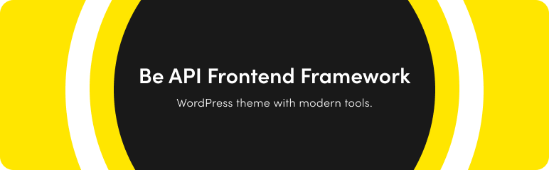

# Be API FrontEnd Framework

[](https://beapi.fr)

[](https://GitHub.com/Naereen/StrapDown.js/graphs/commit-activity)

## What is BFF ?

**Be API Frontend Framework** *(or BFF)*  is a WordPress theme boilerplate designed to assist you in launching your own WordPress theme using modern tools.

## Requirements

### Composer

You need composer to autoload all your classes from the inc folder.

Use the `beapi/composer-scaffold-theme` package that add it automatically to the composer.json file.
You can add it yourself like this :

```composer.json
    "autoload": {
        "psr-4": {
            "BEA\\Theme\\Framework\\": "content/themes/framework/inc/"
        }
    }
```

### Autoload

The autoload is based on psr-4 and handled by composer.

### Node.js

You need [the latest stable version of Node.js](https://nodejs.org/).

## Installation

Download the latest release of BFF [here](https://github.com/BeAPI/beapi-frontend-framework/releases) and extract the zip archive into your `themes` WordPress's folder.

```bash
|____wp-admin
|____wp-content
| |____plugins
| |____themes
| | |____beapi-frontend-framework
| |____uploads
|____wp-includes
```

Of course, you can rename `beapi-frontend-framework` to define your WordPress theme's name.

Next, go to your theme folder (in the following example, I didn't rename `beapi-frontend-framework`) with your favorite Term software.

```bash
cd wp-content/themes/beapi-frontend-framework
```

Then install node dependencies with Yarn.

```bash
yarn
```

Alternatively, you can use NPM.

```bash
npm install
```

## Configuration

The configurations files are in `config` directory.

### Webpack

You can find the common Webpack settings file in `webpack.common.js`. For development mode purpose, you can edit `webpack.dev.js` file and for production mode, you can edit `webpack.prod.js`.
You also have the loaders in `loaders.js` file and Webpack's plugin in `plugins.js` file.

## How to use BFF ?

After installing dependencies, you can run some commands which are explained below.

### Start with Browser Sync

BFF is configured to work with [lando](https://lando.dev/). If you have a `.lando.yml` file in your project's root, set the path to your file in the `browsersync.config.js` file.

```js
let fileContents = fs.readFileSync('../../../../.lando.yml', 'utf8')
```

Then, run the following command from the theme :

```bash
yarn start
```

BrowserSync will proxy your lando'server based on the name defined in your `.lando.yml`.

### Build

```bash
yarn build
```

### Bundle report

You can launch a bundle report with the following command :

```bash
yarn bundle-report
```
