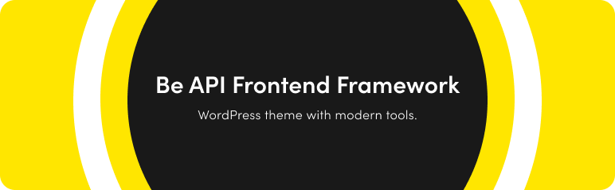

# Be API FrontEnd Framework

[](https://beapi.fr)

[](https://GitHub.com/Naereen/StrapDown.js/graphs/commit-activity)

## What is BFF ?

**Be API Frontend Framework** *(or BFF)*  is a WordPress theme boilerplate designed to assist you in launching your own WordPress theme using modern tools.

## Requirements

### PHP & WordPress

- PHP **8.3** or higher
- WordPress **6.3** or higher

### Composer

You need composer to autoload all your classes from the inc folder.

Use the `beapi/composer-scaffold-theme` package that add it automatically to the composer.json file.
You can add it yourself like this :

```composer.json
    "autoload": {
        "psr-4": {
            "BEA\\Theme\\Framework\\": "content/themes/framework/inc/"
        }
    }
```

### Autoload

The autoload is based on psr-4 and handled by composer.

### Node.js

You need [the latest stable version of Node.js](https://nodejs.org/).

## Installation

Download the latest release of BFF [here](https://github.com/BeAPI/beapi-frontend-framework/releases) and extract the zip archive into your `themes` WordPress's folder.

```bash
|____wp-admin
|____wp-content
| |____plugins
| |____themes
| | |____beapi-frontend-framework
| |____uploads
|____wp-includes
```

Of course, you can rename `beapi-frontend-framework` to define your WordPress theme's name.

Next, go to your theme folder (in the following example, I didn't rename `beapi-frontend-framework`) with your favorite Term software.

```bash
cd wp-content/themes/beapi-frontend-framework
```

Then install node dependencies with Yarn.

```bash
yarn
```

Alternatively, you can use NPM.

```bash
npm install
```

## Local development with wp-env

BFF ships with a [wp-env](https://developer.wordpress.org/block-editor/reference-guides/packages/packages-env/) configuration (`.wp-env.json`) to run a local WordPress instance with Docker.

### Requirements

- [Docker Desktop](https://www.docker.com/products/docker-desktop/) (or a compatible Docker runtime)
- Node.js (see [Requirements](#nodejs))

### Installing wp-env

You can run wp-env without a global install via `npx @wordpress/env`, or install the CLI once and use the `wp-env` command:

```bash
# Global install (npm or yarn)
npm install -g @wordpress/env
# or
yarn global add @wordpress/env
```

After installation, replace `npx @wordpress/env` with `wp-env` in the commands below.

### Getting started

From the theme root:

```bash
yarn
npx @wordpress/env start
# or, if wp-env is installed globally:
wp-env start
```

On first start, wp-env will:

- Spin up WordPress (PHP 8.3)
- Mount this theme from the current directory
- Install and activate the [Advanced Custom Fields](https://wordpress.org/plugins/advanced-custom-fields/) plugin

### URLs and credentials

| | |
|---|---|
| Site | http://localhost:8888 |
| Admin | http://localhost:8888/wp-admin |
| Username | `admin` |
| Password | `password` |

### Common commands

```bash
# Start the environment
npx @wordpress/env start   # or: wp-env start

# Stop containers (data is preserved)
npx @wordpress/env stop    # or: wp-env stop

# Remove containers and volumes
npx @wordpress/env destroy # or: wp-env destroy

# Run WP-CLI inside the environment
npx @wordpress/env run cli wp plugin list
# or: wp-env run cli wp plugin list

# Run a command in the theme directory
npx @wordpress/env run cli --env-cwd=wp-content/themes/beapi-frontend-framework composer install
# or: wp-env run cli --env-cwd=wp-content/themes/beapi-frontend-framework composer install
```

### Development workflow

With wp-env running, start the Webpack watcher in a second terminal:

```bash
yarn start
```

Changes to PHP, SCSS, and JavaScript assets are reflected after Webpack rebuilds. Theme PHP changes are picked up immediately thanks to the mounted volume.

## Configuration

The configurations files are in `config` directory.

### Webpack

You can find the common Webpack settings file in `webpack.common.js`. For development mode purpose, you can edit `webpack.dev.js` file and for production mode, you can edit `webpack.prod.js`.
You also have the loaders in `loaders.js` file and Webpack's plugin in `plugins.js` file.

## How to use BFF ?

After installing dependencies, you can run some commands which are explained below.

### Start with Browser Sync

BFF is configured to work with [lando](https://lando.dev/). If you have a `.lando.yml` file in your project's root, set the path to your file in the `browsersync.config.js` file.

```js
let fileContents = fs.readFileSync('../../../../.lando.yml', 'utf8')
```

Then, run the following command from the theme :

```bash
yarn start
```

BrowserSync will proxy your lando'server based on the name defined in your `.lando.yml`.

### Build

```bash
yarn build
```

### Bundle report

You can launch a bundle report with the following command :

```bash
yarn bundle-report
```

## WordPress Editor (Gutenberg)

### Customize blocks

The `bff_editor_custom_settings` filter allow you to customize blocks styles and variations. For example:

```php
add_filter( 'bff_editor_custom_settings', 'customize_editor_settings', 10, 1 );
function customize_editor_settings( $settings ) {
	// Disable all block styles for Separator block
	$settings[ 'disableAllBlocksStyles' ] = [ 'core/separator' ];

	// Disable specific block style for Button block
	$settings[ 'disabledBlocksStyles' ]   = [ 'core/button' => [ 'outline' ] ];

	// Allow only YouTube variation for Embed block
	$settings[ 'allowedBlocksVariations' ] = [ 'core/embed' => [ 'youtube' ] ];

	return $settings;
}
```
