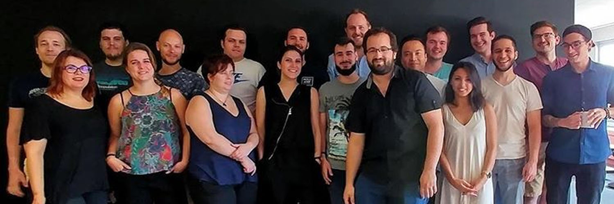

#  BeAPI FrontEnd Framework
##  What is it ?
BeAPI FrontEnd Framework (BFF) is an open source framework for WordPress stacks. Mobile-first projects with a large useful tools for the Frontend Development like Webpack 3, PUG (Jade), LivingCSS, SASS, Critical CSS, Favicons generation and custom tools like ComposerJS.

## 💻 Installation
Clone the repository in the WordPress's themes folder. Remove the `.git` folder in order to work with your own repo.

```
$ cd wp-content/themes
$ git clone https://github.com/BeAPI/beapi-frontend-framework.git name_of_my_theme
$ cd name_of_my_theme
$ mv build.sh ../../../
$ rm -rf .git
```
Then install dependencies width NPM.
```
$ npm install
```
Or using Yarn.
```
$ yarn
```
## 🔧 Configuration
In the `config` directory, you can find the Webpack configurations files.
- _browser-sync.js_ — the Browser Sync configuration
- _config.js —_ the configuration settings (entries, output, port etc…)
- _css-loader.js —_ the common loaders for CSS, SASS and SCSS filetypes
- _webpack.base.js_ — the basic configuration of Webpack for development and production purpose
- _webpack.dev.js_ — the configuration of Webpack for development purpose
- _webpack.prod.js_ — the configuration of Webpack for production purpose

## 📦 How to use it ?
### Local Server with Browser Sync
You can launch a local php server with Browser Sync using :
```
$ npm start
```
### Development purpose
If you don't need this server you can just compile styles and JS using :
```
$ npm run build:dev
```
### Production purpose
For production purpose, you can compile all of your assets by using :
```
$ npm run build:prod
```
If want to bump your WordPress theme version you can add a flag like this :
```
$ npm run build:prod -- -t minor
```
For example, if you have a 1.2.1 theme version, it will be bumped to 1.3.0. You can replace `minor` by `patch` or `major`.

### Favicons and appicons generation
You can also generate appicons and favicons from the sources files in `src/img/favicons/` by using :
```
$ npm run favicon
```

### Bump of WordPress theme version
To prevent WordPress and/or browsers cache issues, you can update the version of `style.css` in the theme's root. There are 3 kinds of update available : `patch`, `minor` or `major`.
```
$ npm run bump [-t | -type] [patch | minor | major]
```
In the case of a multiple themes of a Wordpress project, you can use the previous task in any themes in one command with a bash script. _To use the command, you have to be in the Wordpress root path._ By the way, you can specify the type of bump wanted.

```
$ sh build.sh [-t | -type] [patch | minor | major]
```

### PUG (Jade) templates ###

We use [PUG](https://pugjs.org/api/getting-started.html) for developping HTML static gabarits. PUG templates are in `src/templates/` path.

See [PUG documentation](https://pugjs.org/api/getting-started.html) for more information.

### CSS/SASS Guideline ###

We like to present and order our css like this:

    .module {
        Position properties (z-index, top etc.)
        Display properties (padding, margin, border etc.)
        Text properties (font-family etc.)
        Colors properties (color, background, etc.)
        Mixins (transition etc.)
        Others (white-space etc.)
        @include media($desktop-small) {
            Responsive stuffs
        }
    }

We do not fully respect the BEM css method but we like this kind of OOCSS:

    .module-name (.header)
    .module-name__element (.header__column, .header__button etc.)
    .module-name__element--modifier (.header__element--visible, .header__element--color-2 etc.)

Keep in mind that your class will be more reusable if they are generic enough. If you have too much subelements in your class, there's a problem in your markup.

For example

    .entry-metas
    .entry-metas__date
    .entry-metas__date__month
Should be

    .entry-metas
    .entry-date
    .entry-date__month
Cause date element could be used outside metas. You shouldn't have more than 1 subelement, except in really specifical cases.

We like to keep our code clean and readable. This is why we skip lines between each selectors and add empty line between declarations and includes (like media queries)

    // Example
    .class,
    .class--alt {
      attr: value;

      @media screen and (min-width: $breakpoint) {
        attr: value;
      }
    }


CSS partials are classified and saved in 6 mains folders

* *root*. Where you're define common base. Variables, Mixins, Fonts, Susy library etc.
* *vendor*. It's where external ressources are (jQuery plugins fr example).
* *plugins*. One file by WordPress plugins (Mailpoet, WPForms etc.). in order to define the base style of plugin in the theme. Make specific style in your patterns or pages.
* *components*. The basics like button forms elements etc. It's where you can defined you root's styles for button input headings etc.
* *patterns*. it's related to your modules. It's where you defined the basics for your module.
* *pages*. a css file for each pages. very useful for change module behavior in a specific context.
* All those parts are referenced in *src/css/style.scss*. Don't forget to add your files here in the correct order.

### JS Guideline ###

As said above all JavaScript ressources are compiled with Webpack with a sourcemap for debbugging.

If you need a library, install it with npm.

    $ npm install --save my_lib

Then you can require it where you need to use it, like this :

    $ import npm_lib from 'npm_lib'

If there is no packages available on npm for the library you need, paste the dist file into js vendor folder. Then you have to require it :

    $ import vendor_lib from '../vendor/vendor_lib'


We are using ESLint coding Standard : https://github.com/standard/standard

### Composer JS ###

In order to keep a lightweight stack, you can add extra components that are used most of the time in Web dev. You have to use [composerjs](composerjs)

### LivingCSS / Styleguide ###

SASS file are commented in order to generate a living styleguide using `npm run livingcss`
It is also available at `your_local_url/livingcss/html/` and watched by `gulp serve`
For more details look at : https://github.com/straker/livingcss

### Responsive images ###

WordPress native thumbnails are not enough for us. We want to build images:
* That can have differents art direction between differents viewports
* That can be displayed in the good resolution
* That can be lazyloaded, but still accessible if no Javascript.

Something like this:

```
   <picture>
        <!--[if IE 9]><video style="display: none"><![endif]-->
        <source
            srcset="data:image/gif;base64,R0lGODlhAQABAAAAACH5BAEKAAEALAAAAAABAAEAAAICTAEAOw=="
            data-srcset="img-mobile, img-mobile 2x"
            media="(max-width: 375px)" />
        <source
            srcset="data:image/gif;base64,R0lGODlhAQABAAAAACH5BAEKAAEALAAAAAABAAEAAAICTAEAOw=="
            data-srcset="img-tablet, img-tablet 2x"
            media="(max-width: 1024px)" />
        <source
            srcset="data:image/gif;base64,R0lGODlhAQABAAAAACH5BAEKAAEALAAAAAABAAEAAAICTAEAOw=="
            data-srcset="img-desktop, img-desktop 2x" />
        <!--[if IE 9]></video><![endif]-->
        
    </picture>
```

We use [Node Imagemagick](https://github.com/rsms/node-imagemagick) to generate cropped images from `src/img/sample/` to the build.

* provide a 2x img with "x" descriptor. perfect for thumbnails. ( srcset="my_image, my_image-HD 2x" )
* provide a range of image depend on viewport with "w" descriptor. ( srcset="my_image-mobile 480w, my_image-tablet 768w, etc." )

You can define image sizes in `src/conf-img/images-sizes.json`for example, a 100x100px cropped image:

    "img-100-100":
        {
            "width":"100",
            "height":"100",
            "crop":true
        }

And when your image sizes are made you have to pass them in a `src/conf-img/images-locations.json` like this :

```
   "entry-img-01": [
      {
        "srcsets": [
          {
            "size": "img-100-100"
          },
          {
            "size": "img-200-200"
          },
          {
            "size": "img-300-200"
          },
          {
            "size": "img-600-400"
          }
        ],
        "default_img": "default-300-200.jpg",
        "img_base": "img-300-200"
      }
    ]
```

`default_img` is used for default image if no image are provoded in WordPress Admin. `img_base` is used as fallback for older browser.

Now you have to build you're picture template in `src/conf-img/tpl`. `default-picture.tpl` is the main `<picture>` container. In this tpl we can see the reference for the sources we want, for example in `entry-img-01.tpl` we want a square image under 1024px viewport, displayed in normal or 2x resolution, for bigger screen a landscape image:

    <source data-srcset="%%img-100-100%%, %%img-200-200%% 2x" media="(max-width: 1024px)" %%srcset%% />
    <source data-srcset="%%img-300-200%%, %%img-600-400%% 2x" %%srcset%% />


Now you can use a PUG mixin in your PUG templates.

    +bea-img("beapi_theme-img-2.jpg", "entry-img-01", "entry__img", "My awesome image")

* The first parameter is the image filename
* Second parameter is the data-location name specified in `images-locations.json` file
* Third parameter is the className.
* Fourth parameter is the value of the `alt` attribute.

This PUG example :

    +bea-img("beapi_theme-img-2.jpg", "entry-img-01", "entry__img", "My awesome image")

will generate in HTML :

    <noscript>
        
    </noscript>
    <picture>
        <!--[if IE 9]><video style="display: none"><![endif]-->
        <source data-srcset="assets/img/sample/beapi_theme-img-2-100-100.jpg, assets/img/sample/beapi_theme-img-2-200-200.jpg 2x" srcset="data:image/gif;base64,R0lGODlhAQABAAAAACH5BAEKAAEALAAAAAABAAEAAAICTAEAOw==" media="(max-width: 1024px)" data-location="entry-img-01">

        <source data-srcset="assets/img/sample/beapi_theme-img-2-300-200.jpg, assets/img/sample/beapi_theme-img-2-600-400.jpg 2x" srcset="data:image/gif;base64,R0lGODlhAQABAAAAACH5BAEKAAEALAAAAAABAAEAAAICTAEAOw==" data-location="entry-img-01">
        <!--[if IE 9]></video><![endif]-->

        
    </picture>

We add Lazyload support too! We use [Lazysize](https://github.com/aFarkas/lazysizes) in addition to picturefill in order to provide responsive image served as fast as possible.

If you don't want this feature you still can set BEA_LAZYSIZE to false in /functions/class-bea-images.php. it will turn the markup to basic img tag with srcset.

Lazysize is also used for displaying background image in different sizes for differents viewports. Look at the Lazysize bgset documentation and the `page__header` or `hero` pattern in the LivingCSS.
